# Damolak Web App - DevOps Engineer Practical Challenge

---

## Overview

This repository contains a production-ready application deployment built with modern DevOps practices. The solution demonstrates end-to-end automation; from infrastructure provisioning to containerized application deployment - using Terraform, Jenkins CI/CD, Docker, AWS EC2, Amazon ECR, and CloudWatch.

**Live App:** `http://54.227.22.164:3000`  
**Jenkins CI/CD:** `http://3.80.105.226:8080`

---

## Architecture Overview

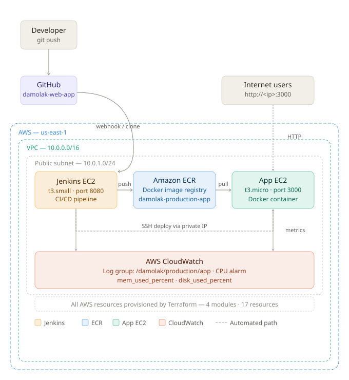

The solution runs two EC2 instances inside a custom VPC on AWS:

**Jenkins EC2 (t3.small)** - hosts the CI/CD pipeline. It watches GitHub for new commits, builds Docker images, runs health check tests, pushes images to Amazon ECR, and deploys to the App EC2 via SSH over the private network.

**App EC2 (t3.micro)** - runs the containerized Node.js application. SSH access is restricted to the Jenkins security group only. Port 3000 is open to the internet for application traffic.

**End-to-end flow:**

1. Developer pushes code to GitHub
2. Jenkins pulls the repo, builds a Docker image using a multi-stage Dockerfile
3. Jenkins runs a health check test against the container
4. On success, the image is tagged and pushed to Amazon ECR
5. Jenkins SSHs into the App EC2 via private IP and runs the deploy script
6. The deploy script pulls the new image from ECR, stops the old container, and starts the new one
7. Jenkins verifies the deployment by hitting the `/health` endpoint
8. CloudWatch monitors the App EC2 for CPU, memory, and disk metrics

**AWS Resources provisioned by Terraform:**

- **VPC** - 10.0.0.0/16, DNS support and hostnames enabled
- **Public Subnet** - 10.0.1.0/24, us-east-1a, public IP on launch
- **Internet Gateway** - attached to VPC for public internet access
- **Route Table** - public route (0.0.0.0/0) to the IGW
- **Jenkins Security Group** - SSH + port 8080 restricted to operator IP only
- **App Security Group** - SSH from Jenkins SG only, port 3000 open to internet
- **ECR Repository** - damolak-production-app, image scan on push enabled
- **ECR Lifecycle Policy** - untagged images expire in 1 day, last 10 tagged images kept
- **IAM Role + Instance Profile** - ECR and CloudWatch access via instance profile, no hardcoded credentials
- **Jenkins EC2** - t3.small, gp3 20GB, Amazon Linux 2
- **App EC2** - t3.micro, gp3 10GB, Amazon Linux 2
- **CloudWatch Log Group** - /damolak/production/app, 7-day retention
- **CloudWatch CPU Alarm** - triggers when CPU exceeds 80% for 4 consecutive minutes

---

## Screenshots

**Damolak web app:**

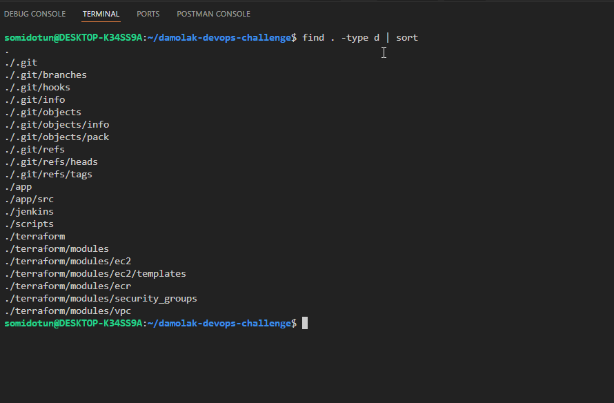

**App landing page and health check:**

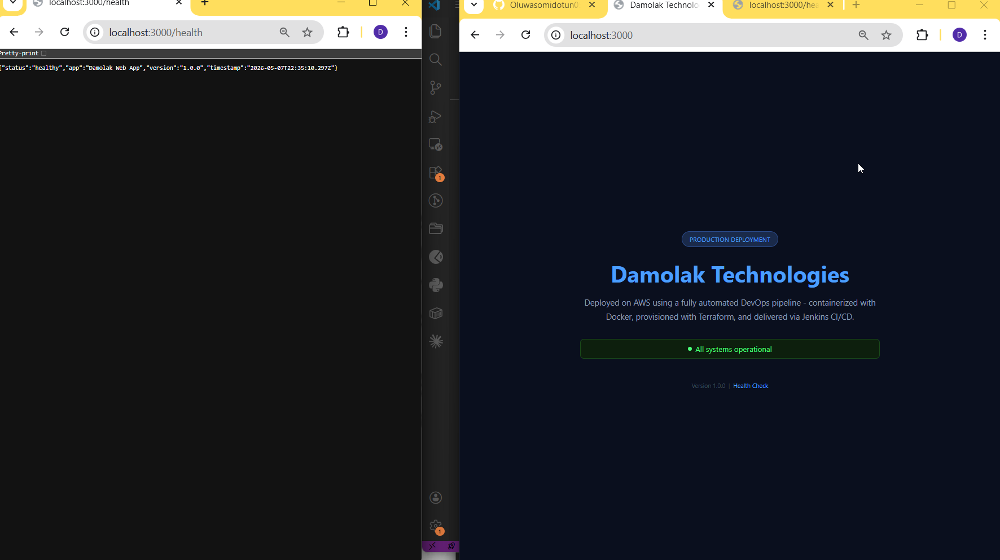

**App running in Docker:**

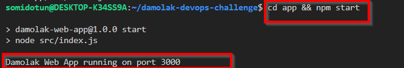

**Docker build:**

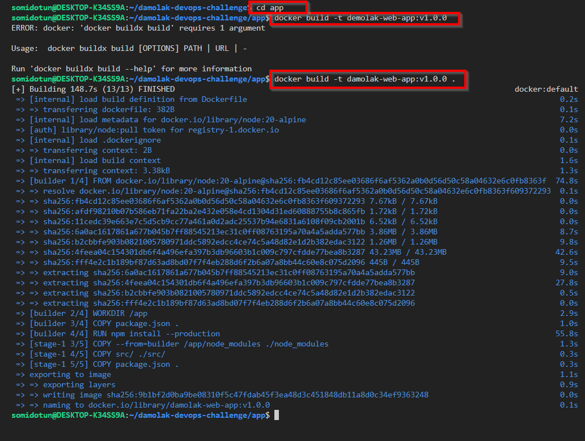

**Terraform file structure:**

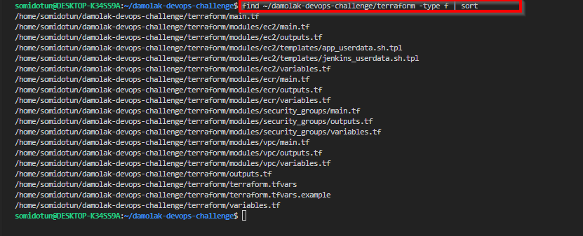

**Terraform apply:**

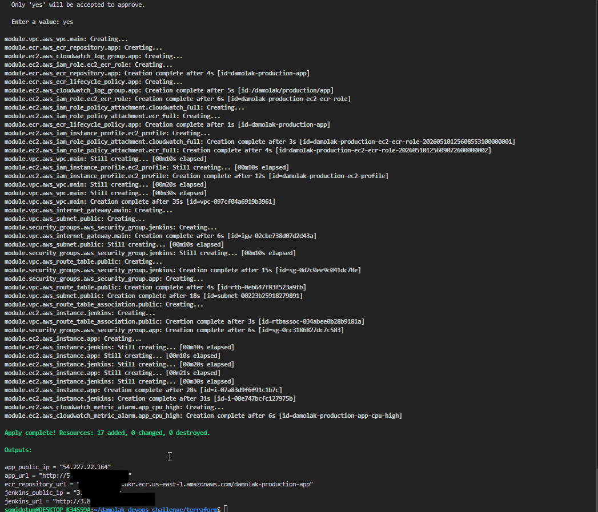

**Terraform init:**

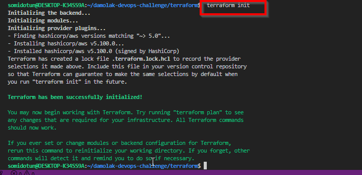

**Jenkins file check:**

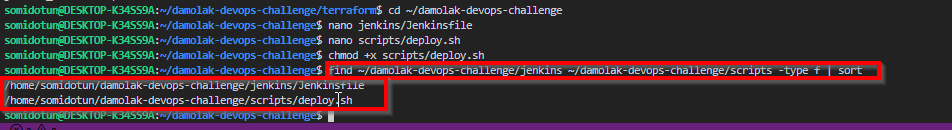

**Jenkins setup:**

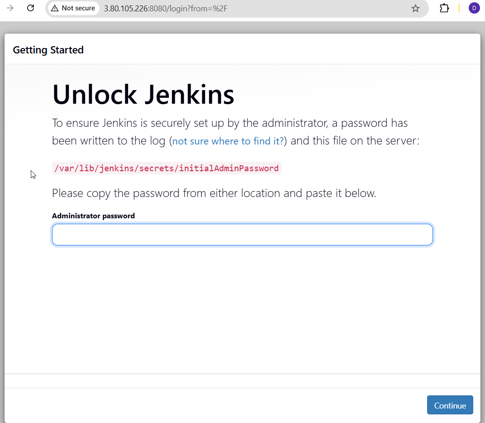

**Jenkins dashboard:**

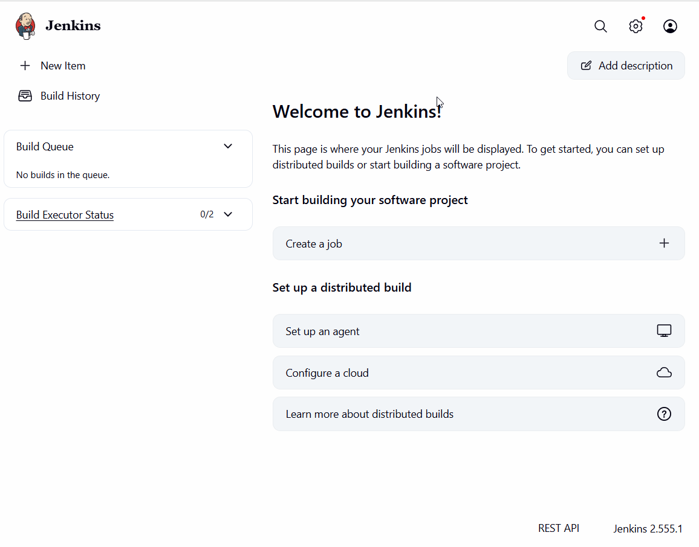

**GitHub push:**

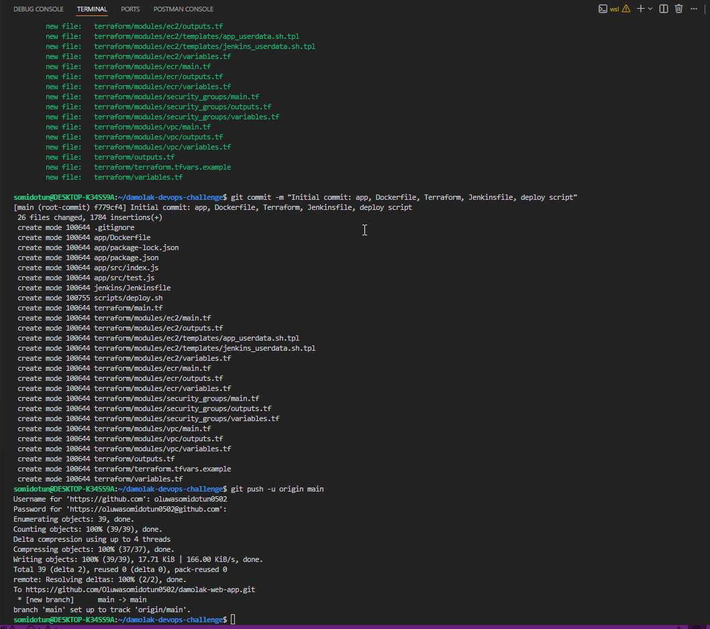

**Jenkins pipeline job:**

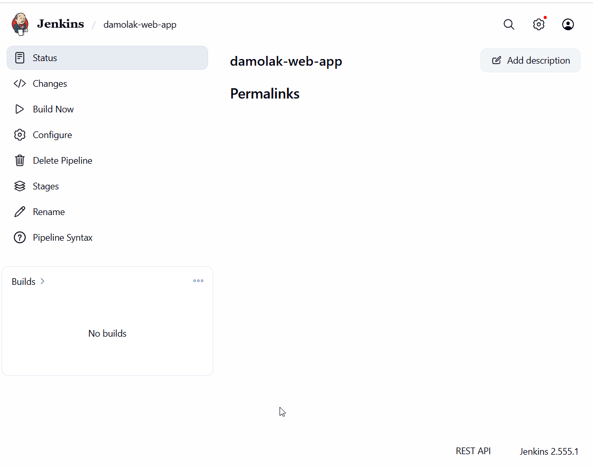

**Successful pipeline build:**

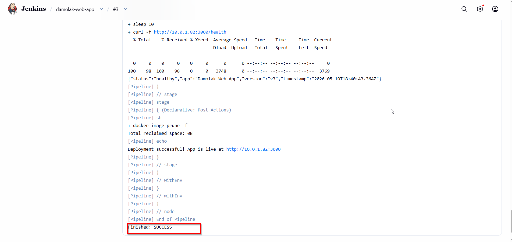

**CloudWatch monitoring overview:**

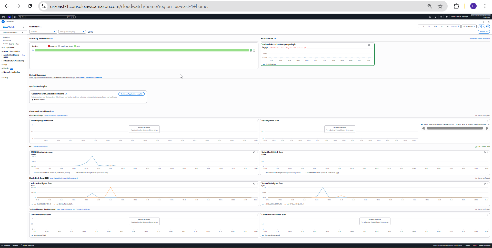

**CloudWatch memory metric:**

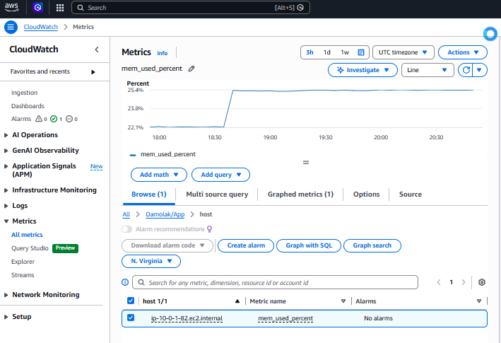

**CloudWatch disk metric:**

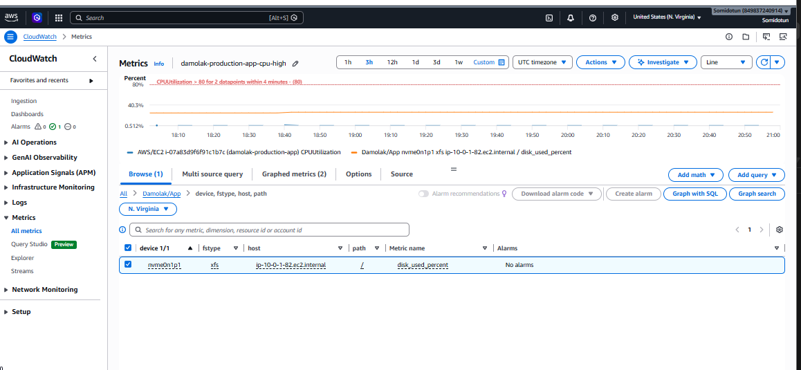

**CloudWatch CPU alarm:**

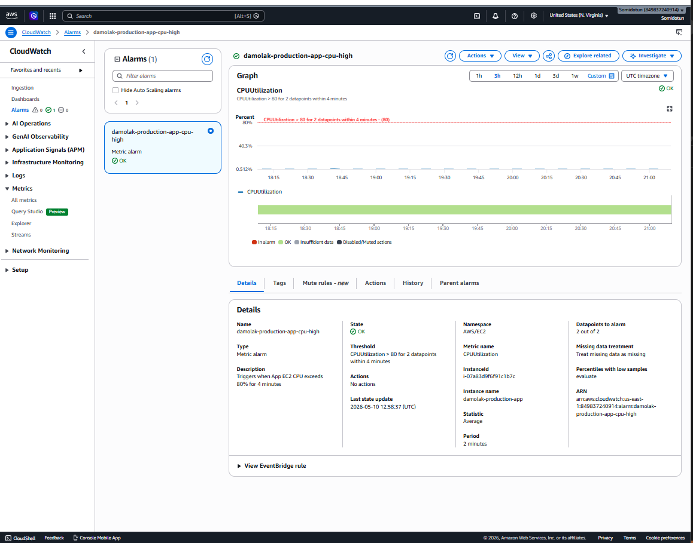

---

## Tech Stack

- **Infrastructure:** Terraform - modular, 4 modules, 17 resources
- **CI/CD:** Jenkins 2.555 running on EC2
- **Containerization:** Docker multi-stage build + Amazon ECR
- **Cloud:** AWS EC2, VPC, IAM, ECR
- **Monitoring:** AWS CloudWatch - logs, custom metrics, alarms
- **Application:** Node.js + Express
- **Source Control:** GitHub

---

## Project Structure

```
damolak-web-app/
├── app/
│   ├── src/
│   │   ├── index.js          # Express app with / and /health endpoints
│   │   └── test.js           # Health check test script
│   ├── Dockerfile            # Multi-stage Docker build
│   └── package.json
├── terraform/
│   ├── main.tf               # Root module — calls all child modules
│   ├── variables.tf          # Input variables with defaults
│   ├── outputs.tf            # Outputs: IPs, URLs, ECR URL
│   ├── terraform.tfvars.example
│   └── modules/
│       ├── vpc/              # VPC, subnet, IGW, route table
│       ├── security_groups/  # Jenkins SG + App SG
│       ├── ecr/              # ECR repository + lifecycle policy
│       └── ec2/              # EC2 instances, IAM role, CloudWatch
│           └── templates/
│               ├── jenkins_userdata.sh.tpl
│               └── app_userdata.sh.tpl
├── jenkins/
│   └── Jenkinsfile           # Declarative pipeline: build → test → push → deploy → verify
├── scripts/
│   └── deploy.sh             # Runs on App EC2: pull image, restart container
├── docs/
│   └── architecture.svg      # Architecture diagram
└── README.md
```

---

## Deployment Steps

### Prerequisites

- AWS CLI installed and configured (`aws configure --profile damolak`)
- Terraform >= 1.3.0
- An EC2 key pair created in us-east-1
- Git installed

### 1. Clone the repository

```bash
git clone https://github.com/Oluwasomidotun0502/damolak-web-app.git
cd damolak-web-app
```

### 2. Configure Terraform variables

```bash
cp terraform/terraform.tfvars.example terraform/terraform.tfvars
```

Edit `terraform.tfvars` with your values:

```hcl
aws_region            = "us-east-1"
key_name              = "your-keypair-name"
your_ip               = "YOUR_PUBLIC_IP/32"   # curl checkip.amazonaws.com
jenkins_instance_type = "t3.small"
app_instance_type     = "t3.micro"
```

### 3. Provision infrastructure

```bash
cd terraform
export AWS_PROFILE=damolak
terraform init
terraform validate
terraform plan
terraform apply
```

Note the outputs - you will need `jenkins_public_ip`, `app_public_ip`, and `ecr_repository_url`.

### 4. Set up Jenkins

Access Jenkins at `http://<jenkins_public_ip>:8080`.

> **Note:** Jenkins takes 5-7 minutes to fully bootstrap after `terraform apply`. If port 8080 is refused, wait and retry.

Jenkins 2.555 requires **Java 21**. If it fails to start, install Java 21 manually:

```bash
ssh -i ~/.ssh/your-key.pem ec2-user@<jenkins_ip> \
  "sudo rpm --import https://yum.corretto.aws/corretto.key && \
   sudo curl -L -o /etc/yum.repos.d/corretto.repo https://yum.corretto.aws/corretto.repo && \
   sudo yum install -y java-21-amazon-corretto-devel && \
   sudo systemctl reset-failed jenkins && sudo systemctl start jenkins"
```

Then complete the Jenkins UI setup: install suggested plugins, create an admin user.

### 5. Copy the SSH key to Jenkins

Jenkins needs the EC2 key pair to SSH into the App EC2 during deployments:

```bash
scp -i ~/.ssh/damolak-key.pem ~/.ssh/damolak-key.pem \
  ec2-user@<jenkins_ip>:/tmp/damolak-key.pem

ssh -i ~/.ssh/damolak-key.pem ec2-user@<jenkins_ip> \
  "sudo mkdir -p /var/lib/jenkins/.ssh && \
   sudo mv /tmp/damolak-key.pem /var/lib/jenkins/.ssh/damolak-key.pem && \
   sudo chmod 400 /var/lib/jenkins/.ssh/damolak-key.pem && \
   sudo chown jenkins:jenkins /var/lib/jenkins/.ssh/damolak-key.pem"
```

### 6. Create the Jenkins pipeline job

In the Jenkins UI:

1. Click **New Item** → name it `damolak-web-app` → select **Pipeline** → click OK
   
2. Under Pipeline: set **Definition** to `Pipeline script from SCM`
   
3. **SCM:** Git, **Repository URL:** `https://github.com/Oluwasomidotun0502/damolak-web-app.git`
   
4. **Branch:** `*/main`, **Script Path:** `jenkins/Jenkinsfile`
   
5. Click **Save**

### 7. Run the pipeline

Click **Build Now**. The pipeline runs 6 stages automatically:

- **Checkout** - pulls latest code from GitHub
- **Build Docker Image** - builds and tags the image
- **Test** - runs health check test against the container
- **Push to ECR** - authenticates and pushes image to ECR
- **Deploy to App EC2** - SSHs into App EC2 and runs deploy.sh
- **Verify Deployment** - confirms `/health` returns 200

### 8. Verify the app is live

```bash
curl http://<app_public_ip>:3000/health
```

Expected response:

```json
{"status":"healthy","app":"Damolak Web App","version":"v3","timestamp":"..."}
```

---

## CI/CD Pipeline

The Jenkinsfile defines a declarative pipeline with these stages:

```
GitHub Push → Jenkins Checkout → Docker Build → Health Check Test
  → Push to ECR → SSH Deploy to App EC2 → Verify /health endpoint
```

Each build is tagged with the Jenkins build number (e.g., `v1`, `v2`, `v3`). This makes every build traceable in ECR and on the running container via the `APP_VERSION` environment variable.

---

## Monitoring & Logging

CloudWatch is configured on the App EC2 with:

- **Log group:** `/damolak/production/app` - collects application logs from `/var/log/app/app.log`
  
- **CPU alarm:** `damolak-production-app-cpu-high` - triggers when CPU > 80% for 4 consecutive minutes
  
- **Custom metrics (Damolak/App namespace):**
  - `mem_used_percent` - memory utilization
  - `disk_used_percent` - disk utilization on `/`

The CloudWatch agent is installed and started automatically via the App EC2 user_data bootstrap script. No manual configuration is required after `terraform apply`.

---

## Design Decisions

**EC2 over ECS/EKS** - EC2 was chosen for clarity and transparency. The deployment mechanism is explicit: Jenkins SSHs in and runs Docker directly. This is easier to understand, debug, and demonstrate than an orchestrated container service. ECS or EKS would be the natural next step for scale.

**Jenkins over GitHub Actions** - Jenkins was preferred as it runs on the same AWS infrastructure, demonstrating the ability to manage self-hosted CI/CD. This is more representative of enterprise environments where managed CI/CD services may not be available or approved.

**Private IP for App EC2 deployment** - Jenkins deploys to the App EC2 using its private IP (`10.0.1.82`) rather than the public IP. The App EC2's SSH rule is locked to the Jenkins security group, not the internet, which is a deliberate security boundary.

**IAM instance profile over access keys** - No AWS credentials are hardcoded anywhere in the codebase. Both EC2 instances use an IAM instance profile for ECR and CloudWatch access. This follows AWS security best practices and eliminates credential rotation concerns.

**Multi-stage Dockerfile** - The builder stage installs npm dependencies; the final stage copies only what is needed to run the app. This keeps the production image lean and avoids shipping development tooling.

**Single AZ deployment** - A single availability zone with one public subnet keeps the infrastructure simple and cost-effective for this assessment scope. The tradeoff is acknowledged under Limitations.

**Dynamic IP management** - When the operator's public IP changes (common with dynamic ISPs), security group ingress rules are updated using the AWS CLI without rerunning the full Terraform plan, keeping the state file clean.

---

## Assumptions

- The AWS account has sufficient service limits for EC2, VPC, ECR, IAM, and CloudWatch resources in us-east-1
  
- The operator's public IP is known at `terraform apply` time and is used to lock SSH and Jenkins UI access
  
- Jenkins post-provisioning setup (Java 21 installation, plugin installation, admin user creation) is performed manually once after the EC2 bootstraps
  
- The Node.js application is intentionally simple; the focus of this challenge is the pipeline, infrastructure, and automation rather than the application itself
  
- The `damolak-terraform` IAM user has AdministratorAccess; in production this would be scoped to least-privilege

---

## Issues Encountered & How They Were Resolved

### 1. Jenkins failed to start - Java version mismatch

**Problem:** Jenkins 2.555 requires Java 21, but the user_data script installed Java 11 (the latest available via `amazon-linux-extras` on Amazon Linux 2). The systemd unit file also used `StartLimitBurst` and `StartLimitIntervalSec` directives unsupported by Amazon Linux 2's older systemd.

**Resolution:** Added the Amazon Corretto yum repository, installed `java-21-amazon-corretto-devel`, patched the Jenkins systemd unit file to remove the unsupported directives, and restarted Jenkins.

### 2. Docker not found in Jenkins pipeline

**Problem:** The first pipeline build failed with `docker: command not found` because Docker had not been installed by the user_data script at the time Jenkins started, and the jenkins user was not in the docker group.

**Resolution:** Installed Docker manually via `amazon-linux-extras install docker`, added the jenkins and ec2-user to the docker group, and restarted Jenkins.

### 3. Deploy stage timed out - wrong IP used for SSH

**Problem:** The Jenkinsfile initially used the App EC2's public IP for the SSH deploy step. The App EC2 security group only permits SSH from the Jenkins security group, not the internet, so the SSH connection timed out consistently.

**Resolution:** Changed `APP_EC2_IP` in the Jenkinsfile to the App EC2's private IP (`10.0.1.82`). Both instances are in the same VPC and subnet, so private routing works correctly and securely.

### 4. Dynamic public IP blocked SSH access

**Problem:** The ISP assigns dynamic public IPs. After reconnecting, the local IP changed, locking the operator out of both Jenkins and the EC2 instances.

**Resolution:** Used `curl checkip.amazonaws.com` to detect the new IP, then updated the security group ingress rules using `aws ec2 revoke-security-group-ingress` and `aws ec2 authorize-security-group-ingress` without touching the Terraform state.

### 5. AWS CLI profile had insufficient permissions

**Problem:** The default AWS CLI profile was configured with a limited IAM user (`cloudguard-scanner`) that could not create VPCs, IAM roles, or ECR repositories.

**Resolution:** Created a new IAM user (`damolak-terraform`) with AdministratorAccess, configured it as a named AWS CLI profile, and used `export AWS_PROFILE=damolak` before all Terraform and AWS CLI commands.

---

## Limitations & Improvements

**Single AZ deployment** - Multi-AZ with an Application Load Balancer would improve availability. Current setup has no redundancy if the AZ goes down.

**No HTTPS** - Adding an ACM certificate with an ALB HTTPS listener would secure traffic in transit. Currently running on plain HTTP port 3000.

**Jenkins setup is partly manual** - Java 21 installation, plugin setup, and admin user creation require manual steps after Terraform provisions the EC2. Ansible or Jenkins Configuration as Code (JCasC) would fully automate this.

**No auto-scaling** - The App EC2 is a single instance. An Auto Scaling Group tied to the CloudWatch CPU alarm would handle traffic spikes automatically.

**Secrets in environment variables** - AWS Secrets Manager or Parameter Store would be more secure than passing secrets via environment variables in the deploy script.

**No deployment rollback** - A blue/green or canary strategy using previous ECR image tags would allow instant rollback on failed deployments.

**Dynamic IP requires manual SG update** - Nigerian ISPs assign dynamic IPs that change on reconnect. An Elastic IP or a VPN would eliminate the need to manually update security group rules.

**App logs go to stdout only** - The container currently logs to stdout. Writing structured logs to `/var/log/app/app.log` would enable full CloudWatch log ingestion via the agent already running on the App EC2.

---

**Author:** Oluwasomidotun Elijah Adepitan  

**LinkedIn:** https://linkedin.com/in/oluwasomidotun-adepitan 

**Email:** Anuoluwapodotun@gmail.com